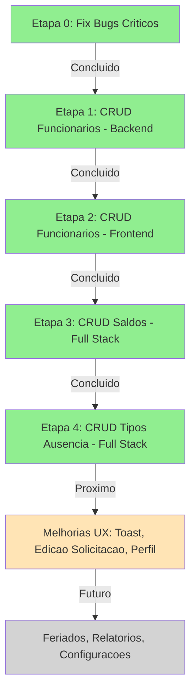

# Plano Incremental - TODOs do Sistema de Ferias

## Analise do Projeto

O projeto esta bem estruturado para um sistema simples: Spring Boot 3 + Vue 3 + Pinia + Tailwind. A arquitetura e limpa e segue bons padroes. Porem, identifiquei **3 bugs criticos** que precisam ser corrigidos antes de qualquer TODO novo.

### Bugs Criticos Encontrados

**Bug 1 - Role inexistente no registro:**

`[AuthService.java](backend/src/main/java/com/empresa/ferias/service/AuthService.java)` linha 53 usa `Role.FUNCIONARIO`, mas o enum `[Role.java](backend/src/main/java/com/empresa/ferias/model/Role.java)` so tem `USER` e `GESTOR`. Isso causa **erro de compilacao** quando alguem tenta se registrar.

```53:backend/src/main/java/com/empresa/ferias/service/AuthService.java
                .role(Role.FUNCIONARIO)
```

Deve ser `Role.USER`.

**Bug 2 - PreAuthorize com roles inexistentes no UsuarioController:**

`[UsuarioController.java](backend/src/main/java/com/empresa/ferias/controller/UsuarioController.java)` linhas 47, 53, 59, 65, 71 usam `hasAnyRole('RH', 'ADMIN')` - essas roles nao existem. Os endpoints de listar usuarios e ver saldos sao **inacessiveis** para qualquer usuario.

```47:48:backend/src/main/java/com/empresa/ferias/controller/UsuarioController.java
    @PreAuthorize("hasAnyRole('RH', 'ADMIN')")
    public ResponseEntity<List<UsuarioDTO>> listarTodos() {
```

Todas devem ser trocadas para `hasRole('GESTOR')`.

**Bug 3 - PreAuthorize com role inexistente no TipoAusenciaController:**

`[TipoAusenciaController.java](backend/src/main/java/com/empresa/ferias/controller/TipoAusenciaController.java)` linha 31 usa `hasAnyRole('RH', 'ADMIN')`. O endpoint de criar tipo de ausencia esta **inacessivel**.

```31:32:backend/src/main/java/com/empresa/ferias/controller/TipoAusenciaController.java
    @PreAuthorize("hasAnyRole('RH', 'ADMIN')")
    public ResponseEntity<TipoAusencia> criar(@RequestBody Map<String, Object> body) {
```

---

### Sobre os TODOs - O que faz sentido para um sistema simples

Analisando o CONTEXT.md, muitos TODOs sao ambiciosos demais para um sistema que deve ser simples. Minha recomendacao:

| TODO | Recomendacao | Motivo |

|------|-------------|--------|

| CRUD Funcionarios | Fazer | Essencial - gestor precisa gerenciar usuarios |

| CRUD Saldos | Fazer | Essencial - ajustar saldos manualmente |

| CRUD Tipos Ausencia | Fazer | Ja existe backend parcial, so falta frontend e completar |

| Calculo CLT automatico | Nao fazer agora | Complexo, regras variam por empresa |

| Import CSV | Nao fazer agora | Premature - poucos usuarios no inicio |

| Config do sistema | Nao fazer agora | Hardcode valores razoaveis por enquanto |

| Feriados | Fase futura | Nice-to-have, nao bloqueia uso |

| Relatorios | Fase futura | Pode ser feito apos CRUDs basicos |

---

## Etapas de Implementacao

### Etapa 0 - Corrigir Bugs Criticos (30 min)

> Testar: compilar backend, tentar registrar novo usuario, verificar endpoints de listagem

- Corrigir `Role.FUNCIONARIO` para `Role.USER` em `[AuthService.java](backend/src/main/java/com/empresa/ferias/service/AuthService.java)`
- Corrigir todos os `@PreAuthorize` em `[UsuarioController.java](backend/src/main/java/com/empresa/ferias/controller/UsuarioController.java)` e `[TipoAusenciaController.java](backend/src/main/java/com/empresa/ferias/controller/TipoAusenciaController.java)` para usar `hasRole('GESTOR')`

### Etapa 1 - CRUD de Funcionarios (Backend) (~2h)

> Testar: via Postman/curl - listar, editar, ativar/desativar usuarios como gestor

Arquivos a alterar/criar:

- Adicionar endpoints PUT em `[UsuarioController.java](backend/src/main/java/com/empresa/ferias/controller/UsuarioController.java)`: editar usuario, alterar role, ativar/desativar
- Adicionar metodos em `[UsuarioService.java](backend/src/main/java/com/empresa/ferias/service/UsuarioService.java)`: atualizar, alterarRole, toggleAtivo
- Criar DTO de request para edicao de usuario (ex: `UpdateUsuarioRequest.java`)

### Etapa 2 - CRUD de Funcionarios (Frontend) (~3h)

> Testar: navegar para tela de gestao, editar um usuario, promover para gestor, desativar conta

Arquivos a criar:

- Nova view `FuncionariosView.vue` - tabela de funcionarios com acoes (editar, ativar/desativar, mudar role)
- Adicionar rota em `[router/index.js](frontend/src/router/index.js)` com `requiresManager: true`
- Adicionar item no menu do `[MainLayout.vue](frontend/src/layouts/MainLayout.vue)`
- Nova store ou expandir `[stores/auth.js](frontend/src/stores/auth.js)` com funcoes de gestao

### Etapa 3 - CRUD de Saldos de Ferias (Backend + Frontend) (~3h)

> Testar: como gestor, visualizar saldo de um funcionario, ajustar manualmente

Backend:

- Novos endpoints em `[UsuarioController.java](backend/src/main/java/com/empresa/ferias/controller/UsuarioController.java)` ou novo `SaldoController.java`: PUT para ajustar saldo, GET para listar saldos de todos
- Metodo em `[UsuarioService.java](backend/src/main/java/com/empresa/ferias/service/UsuarioService.java)`: ajustarSaldo(usuarioId, ano, diasTotais)

Frontend:

- Integrar na tela de `FuncionariosView.vue` - ao clicar num funcionario, ver/editar saldo
- Ou criar componente modal `EditarSaldoModal.vue`

### Etapa 4 - CRUD de Tipos de Ausencia (Backend + Frontend) (~2h)

> Testar: criar novo tipo, editar cor/nome, desativar tipo

Backend (ja parcialmente existe):

- Completar `[TipoAusenciaController.java](backend/src/main/java/com/empresa/ferias/controller/TipoAusenciaController.java)` com PUT (editar) e PATCH (ativar/desativar)
- Completar `[TipoAusenciaService.java](backend/src/main/java/com/empresa/ferias/service/TipoAusenciaService.java)` com metodos de edicao

Frontend:

- Nova view `TiposAusenciaView.vue` - tabela com color picker
- Rota e menu item para gestores

---

## Resumo Visual - Etapas Concluidas




Cada etapa e independente e testavel. Depois da Etapa 4, o sistema tera todas as funcionalidades administrativas essenciais para uso real por um RH/Gestor simples.

---

## Status Atual - Todas as Etapas Concluidas

**Verificado em revisao:**

- Etapa 0: Bugs corrigidos - `Role.USER` em AuthService, `hasRole('GESTOR')` em todos os controllers
- Etapa 1: CRUD Funcionarios Backend completo - endpoints PUT, PATCH para role e toggle-ativo em `[UsuarioController.java](backend/src/main/java/com/empresa/ferias/controller/UsuarioController.java)`
- Etapa 2: CRUD Funcionarios Frontend completo - `[FuncionariosView.vue](frontend/src/views/FuncionariosView.vue)` criada, rotas e menu atualizados
- Etapa 3: CRUD Saldos completo - endpoints de ajuste de saldo implementados, integrado na view de funcionarios
- Etapa 4: CRUD Tipos Ausencia completo - `[TiposAusenciaView.vue](frontend/src/views/TiposAusenciaView.vue)` criada, backend com PUT e PATCH

**Arquivos implementados:**

- Backend: `[UpdateUsuarioRequest.java](backend/src/main/java/com/empresa/ferias/dto/UpdateUsuarioRequest.java)`, metodos em services atualizados
- Frontend: Views criadas, rotas adicionadas em `[router/index.js](frontend/src/router/index.js)`, menu atualizado em `[MainLayout.vue](frontend/src/layouts/MainLayout.vue)`

---

## Proximos Passos Sugeridos

Baseado no CONTEXT.md, aqui estao os proximos TODOs por prioridade:

### Prioridade Media - Melhorias de UX/Qualidade

1. **Edicao de Solicitacao (antes de aprovar)**
  - Permitir usuario editar solicitacao pendente
  - Backend: endpoint PUT em `[SolicitacaoController.java](backend/src/main/java/com/empresa/ferias/controller/SolicitacaoController.java)`
  - Frontend: botao "Editar" em `[MinhasSolicitacoesView.vue](frontend/src/views/MinhasSolicitacoesView.vue)`
2. **Perfil do Usuario Editavel**
  - Usuario pode editar proprio nome, cargo (nao email)
  - Endpoint PUT `/api/usuarios/me` em `[UsuarioController.java](backend/src/main/java/com/empresa/ferias/controller/UsuarioController.java)`
3. **Reset de Senha**
  - Fluxo: solicitar reset -> email com token -> nova senha
  - Backend: endpoints POST `/api/auth/forgot-password` e POST `/api/auth/reset-password`
  - Frontend: views `ForgotPasswordView.vue` e `ResetPasswordView.vue`
4. **Toast Notifications (em vez de alerts)**
  - Substituir `alert()` por sistema de notificacoes toast
  - Criar componente `Toast.vue` e composable `useToast.js`
  - Integrar em todas as views

### Prioridade Baixa - Funcionalidades Adicionais

1. **Feriados (CRUD)**
  - Model `Feriado.java` com data, nome, tipo (nacional/estadual)
  - Backend: CRUD completo
  - Frontend: view de gestao de feriados
  - Calendario nao conta feriados como dias de ferias
2. **Relatorios Basicos**
  - Funcionarios com ferias vencendo (periodo concessivo)
  - Historico de solicitacoes por periodo
  - Exportar para PDF (usar biblioteca como jsPDF no frontend)
3. **Configuracoes do Sistema**
  - Model `Configuracao.java` com chave-valor
  - Configuracoes: dias minimos/maximos por solicitacao, antecedencia minima
  - Validar essas regras ao criar solicitacao

### Nao Recomendado Agora (Complexo demais para sistema simples)

- Calculo CLT automatico (periodo aquisitivo/concessivo) - varia muito por empresa
- Import CSV - premature optimization
- Integracoes externas (Google Calendar, Slack) - adicionar depois se necessario
- Aprovacao em cadeia - sistema atual e simples e funciona

---

## Recomendacao Imediata

Comecar pela **Prioridade Media**, especialmente:

1. Toast notifications (melhora UX significativamente)
2. Edicao de solicitacao (funcionalidade muito util)
3. Perfil editavel (basico e rapido)

Essas 3 melhorias tornam o sistema mais completo e profissional sem adicionar complexidade desnecessaria.